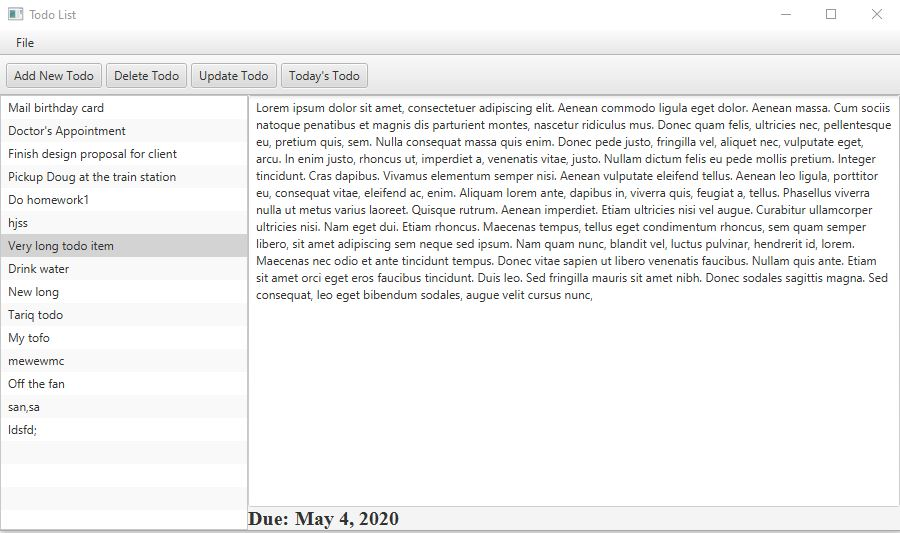

# TodoList
## Introduction
##   TodoList JavaFx Application with mySql database..  
##   <u>Following tools, concepts and technologies are used in the application :<u> 
<ol>
<li> <b>JavaFx </b>
<li> <b>mySQL database</b>
</ol>

    
  

If you have any queries or suggestions you can mail me: f158185@nu.edu.pk

You are welcome to suggest any changes, just send a pull request.
